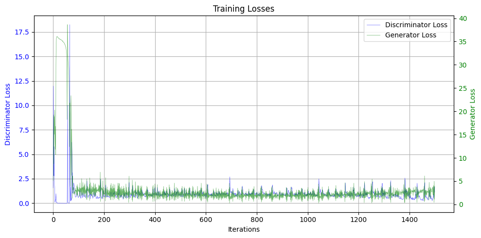
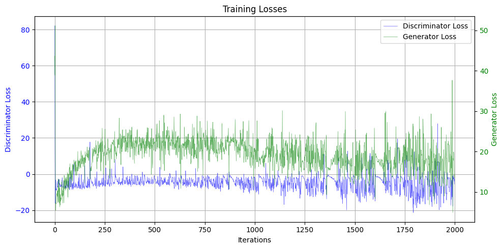
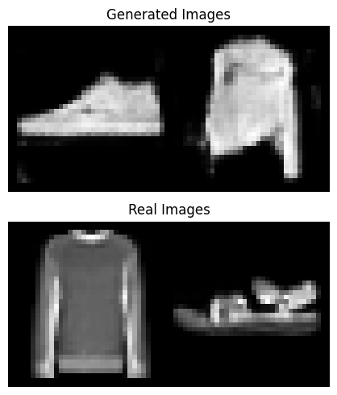
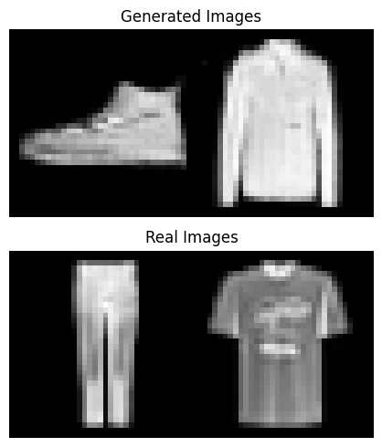

# Improved Training of GAN

## Introduction
Generative Adversarial Networks (GANs) have shown remarkable success in generating realistic data samples. This project, inspired by the paper "Improved Training of GAN," aims to enhance the training process of GANs by implementing improved techniques. We explore the performance of two popular GAN architectures: Deep Convolutional GAN (DCGAN) and Wasserstein GAN (WGAN) with Gradient Penalty.

## Training
Please run all 3 initial sections, followed by the Training sections.
Run all helper functions, until the "Train DCGAN" and "Train WGAN" cells, and run each one as desired.
The model will be saved locally in `saved_models`.

### Losses Plot
Below are the loss plots for DCGAN and WGAN-GP:

**DCGAN Loss Plot:**



**WGAN-GP Loss Plot:**



## Evaluation
If there are no saved models, please train a GAN, refer to previous section.
For evaluation, run all cells in Evaluation section.

Change `num_samples` in  `load_and_plot_samples(generator_path, gan_train_config, device, data_loader=data_loader,num_samples=num_samples)` to change number of random samples generated and real samples next to them:

``` 
generator_path = os.path.join(save_path, f'wgan_generator.pth')
load_and_plot_samples(generator_path, gan_train_config['wgan'], device, data_loader=data_loader,num_samples=2)
```
Each invokation of the evaluation cell will result in different samples.

### Generated Samples
We also provide samples generated by each model which can be reproduced in the evaluation section:

**DCGAN Generated Samples:**



**WGAN-GP Generated Samples:**



## References
1. **Improved Training of GANs.** (2017). [Link to the paper](https://arxiv.org/abs/1704.00028)
2. **Unsupervised Representation Learning with Deep Convolutional Generative Adversarial Networks.** (2015). [Link to the paper](https://arxiv.org/abs/1511.06434)
3. **Wasserstein GAN.** (2017). [Link to the paper](https://arxiv.org/abs/1701.07875)
4. **Improved Training of Wasserstein GANs.** (2017). [Link to the paper](https://arxiv.org/abs/1704.00028)
